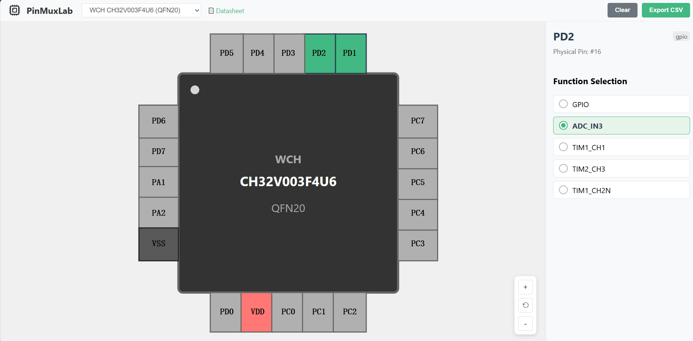

# **PinMuxLab** 

An open-source MCU pin & peripheral allocation visualizer

**核心目标：** 为无专用可视化配置工具的 MCU（如沁恒等）提供网页版引脚管理界面，解决引脚复用查询难、分配易冲突的问题。

## 预览:

[https://duruofu.github.io/PinMuxLab](https://duruofu.github.io/PinMuxLab)



## 需求：

参考：[基础需求分析](./docs/基础需求,md)

## 架构:

```txt
┌─────────────┐
│ 芯片描述数据 │  ← JSON
└─────┬───────┘
      │
┌─────▼────────────────────┐
│   Pin / Peripheral Model  │  ← 核心抽象层
└─────┬────────────────────┘
      │
┌─────▼───────────┐
│  Vue 状态管理    │  (Pinia)
└─────┬───────────┘
      │
┌─────▼────────────────────┐
│  可视化层 (SVG) │
└──────────────────────────┘

```

## 芯片数据库文件设计：

参考：[芯片JSON数据定义](./docs/芯片JSON数据定义.md)

## 技术栈：

- 前端框架：Vue 3

- 状态管理：Pinia

- 芯片封装可视化：SVG

  

